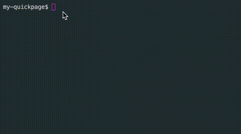

# QUICKPAGE

<a href="https://github.com/WhatisHappyPlanet/quickpage/blob/master/LICENSE">
  
</a>

This repo is about modern multi-page web application powered by vite.js.

It includes [quickpage-cli](./packages/quickpage) and [create-quickpage](./packages/create-quickpage).

## How to contribute

If you want to develope or contribute this project, you should learn how to develop a command line.

First, `pnpm` is preferred in this workspace.

```bash
pnpm i
```

Second, you should link this project into your local development environment.

```bash
cd packages/quickpage
sudo npm link
```

Then, you can change the code and rebuild the cli.

```bash
pnpm i

#or 

pnpm run prepare --filter quickpage-cli

#or

pnpm run prepare --recursive

```

You can publish it by pnpm.

```bash
pnpm -r publish
```

## Screen shots





## LICENSE

[MIT](./LINCESE)@HappyPlanet
